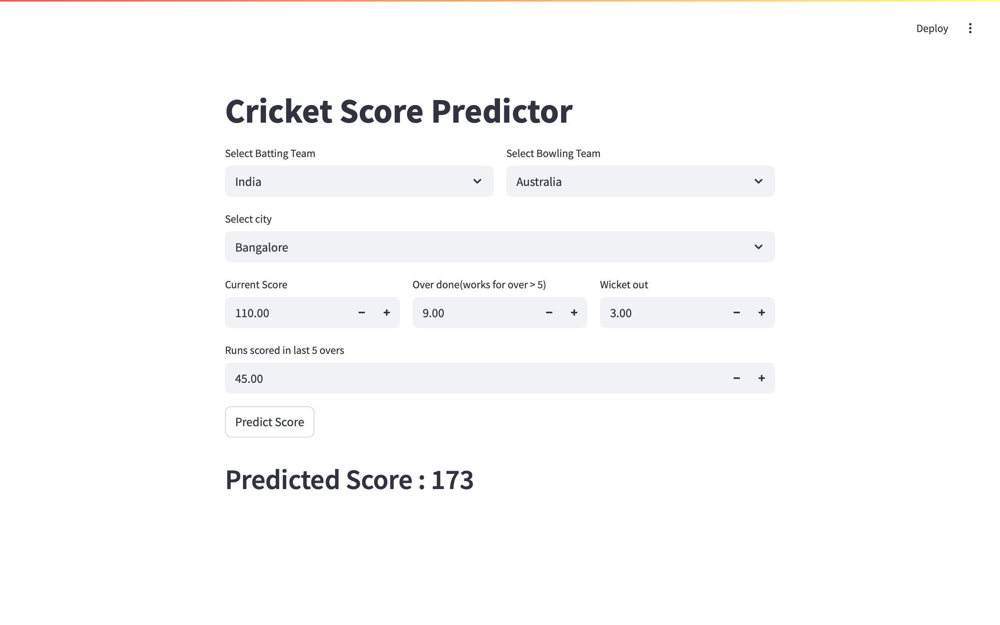
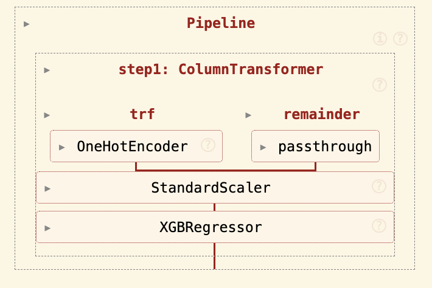
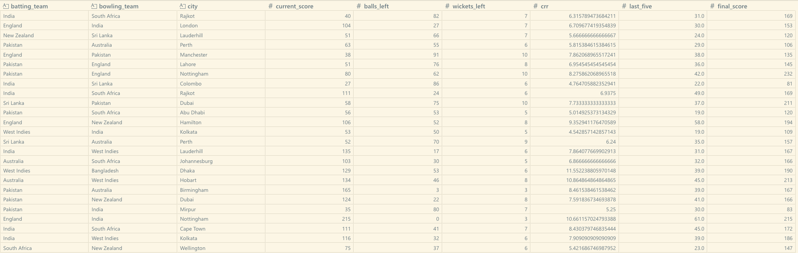

# 🏏 T20 Cricket Score Predictor

This project is a **machine learning-powered web application** that predicts the final score of a T20 cricket match based on current match conditions. It simulates how analysts or coaches might project match outcomes in real-time using data-driven techniques. Built using Python and deployed via **Streamlit**, this project covers the full machine learning pipeline — from raw data ingestion to model deployment.

Whether you're a cricket enthusiast, data science student, or a machine learning engineer, this project demonstrates how AI can be used in the sports analytics domain in a practical and engaging way.

---

## 🧠 Problem Statement

In T20 cricket, predicting the final score can be valuable for strategizing gameplay, setting field placements, and making informed decisions. This project aims to estimate the **final match score** using parameters such as:

- Current runs
- Overs completed
- Wickets fallen
- Recent scoring pace
- Match location
- Batting and bowling teams

Using historical match data, the trained ML model generalizes to predict outcomes of ongoing games in a realistic manner.

---

## 🚀 Live Demo

The project is deployed on Render and can be accessed here:

🔗 **[Live App on Render](https://t20-score-predictor-avba.onrender.com/)**  

You can also run this app locally using Streamlit (instructions below).

---

## 📌 Key Features

### ✅ Intuitive Streamlit Web App
- Simple, clean, and responsive UI for user input and prediction.
- Dropdowns for selecting teams and cities.
- Numeric input for overs, score, wickets, and last 5 overs.

### ✅ Smart Feature Engineering
- Derived features like:
  - `balls_left`
  - `wickets_left`
  - `crr (current run rate)`
  - `last_five (runs in last 5 overs)`
- Encoded categorical data using `ColumnTransformer` and `OneHotEncoder`.

### ✅ Accurate Machine Learning Model
- Trained using **XGBoost Regressor**, known for its speed and performance.
- Achieved high **R² score (~0.98)** and low **mean absolute error (~1.78)**.
- Model pipeline serialized using Pickle for deployment.

### ✅ End-to-End Machine Learning Lifecycle
- YAML-based data ingestion and parsing.
- Data preprocessing and transformation.
- Model training, evaluation, and saving.
- Frontend deployment using Streamlit.

### ✅ Modular Project Structure
- Clean separation of concerns using notebooks, data files, and scripts.
- Easy to navigate and extend further for analysis or enhancements.

---

## 📊 Dataset

The dataset is sourced from Kaggle and consists of T20 match records.  
You can find the dataset here:  
**[T20 Cricket Match Dataset on Kaggle](https://www.kaggle.com/datasets/veeralakrishna/cricsheet-a-retrosheet-for-cricket/data?select=t20s)**  

- Format: YAML
- Parsed into structured DataFrame
- Used for training the regression model after feature extraction

---

## 📈 Model Performance

- **Algorithm**: XGBoost Regressor
- **R² Score**: `0.987`
- **MAE**: `1.78`
- **Features Used**:
  - Batting Team
  - Bowling Team
  - City
  - Current Score
  - Overs Completed
  - Wickets Left
  - Balls Left
  - Last 5 Overs Runs
  - Current Run Rate

---

## 🗂️ Project Structure

```
project-root/
│
├── app.py                        # Streamlit frontend
├── requirements.txt              # Dependencies
├── .gitignore
│
├── data/
│   ├── final_data.pkl
│   ├── dataset_level0.pkl
│   ├── dataset_level1.pkl
│   └── backup.pkl
│
├── model/
│   └── model.pkl
│
└── notebooks/
    ├── data_extraction.ipynb
    ├── feature_extractiton.ipynb
    └── model_building.ipynb
```

---

## 📸 Screenshots

### 🔢 Streamlit UI


### 🧠 Model Pipeline


### 📊 Final Dataset Sample


---

## 🛠️ Setup Instructions

### 🔧 Clone the Repository
```bash
git clone https://github.com/Dipesh-Ydv/T20-Score-Predictor.git
cd T20-Score-Predictor
```

### 📦 Create a Virtual Environment (optional)
```bash
python -m venv venv
source venv/bin/activate      # For Linux/macOS
venv\Scripts\activate       # For Windows
```

### 📥 Install Dependencies
```bash
pip install -r requirements.txt
```

### ▶️ Run the App
```bash
streamlit run app.py
```

---

## 🙋‍♂️ Author

**Dipesh Yadav**  
📍 Gurugram, Haryana  
🔗 [LinkedIn](https://linkedin.com/in/dipesh-yadav-datascientist)  
💻 [GitHub](https://github.com/Dipesh-Ydv)

---

## 🙏 Acknowledgements

- [Kaggle](https://www.kaggle.com) for the dataset
- Streamlit for frontend framework
- XGBoost and Scikit-learn for machine learning tools
- Python and Pandas for data handling
